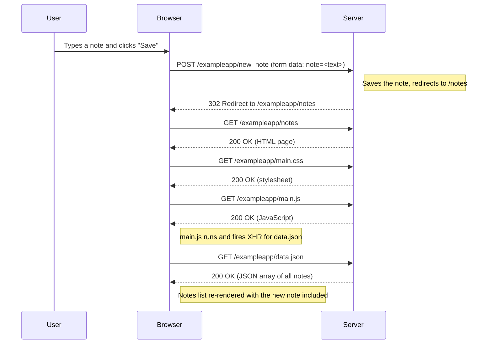

# Exercise 0.4: New Note Sequence Diagram

What happens when a user submits a new note at https://studies.cs.helsinki.fi/exampleapp/notes.

```mermaid
sequenceDiagram
    participant User
    participant Browser
    participant Server

    User->>Browser: Types a note and clicks "Save"
    Browser->>Server: POST /exampleapp/new_note (form data: note=<text>)
    Note right of Server: Saves the note, redirects to /notes
    Server-->>Browser: 302 Redirect to /exampleapp/notes

    Browser->>Server: GET /exampleapp/notes
    Server-->>Browser: 200 OK (HTML page)

    Browser->>Server: GET /exampleapp/main.css
    Server-->>Browser: 200 OK (stylesheet)

    Browser->>Server: GET /exampleapp/main.js
    Server-->>Browser: 200 OK (JavaScript)

    Note right of Browser: main.js runs and fires XHR for data.json
    Browser->>Server: GET /exampleapp/data.json
    Server-->>Browser: 200 OK (JSON array of all notes)

    Note right of Browser: Notes list re-rendered with the new note included
```
