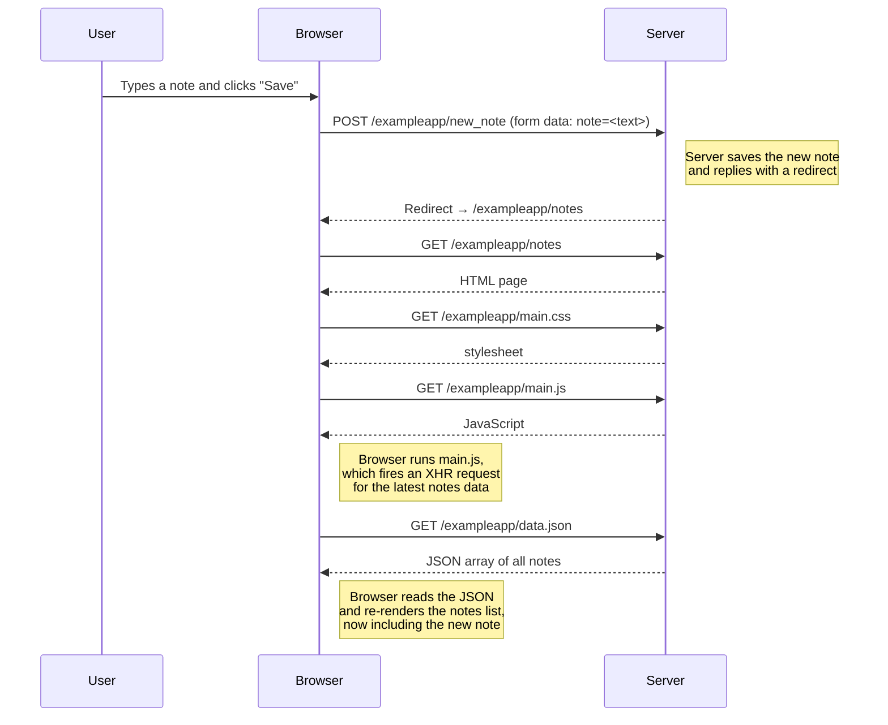

# Exercise 0.4 — New Note Sequence Diagram

This diagram shows what happens when a user submits a new note using the form at the bottom of https://studies.cs.helsinki.fi/exampleapp/notes.

```mermaid
sequenceDiagram
    participant User
    participant Browser
    participant Server

    User->>Browser: Types a note and clicks "Save"
    Browser->>Server: POST /exampleapp/new_note (form data: note=<text>)
    Note right of Server: Server saves the new note<br/>and replies with a redirect
    Server-->>Browser: Redirect → /exampleapp/notes

    Browser->>Server: GET /exampleapp/notes
    Server-->>Browser: HTML page

    Browser->>Server: GET /exampleapp/main.css
    Server-->>Browser: stylesheet

    Browser->>Server: GET /exampleapp/main.js
    Server-->>Browser: JavaScript

    Note right of Browser: Browser runs main.js,<br/>which fires an XHR request<br/>for the latest notes data
    Browser->>Server: GET /exampleapp/data.json
    Server-->>Browser: JSON array of all notes

    Note right of Browser: Browser reads the JSON<br/>and re-renders the notes list,<br/>now including the new note
```
