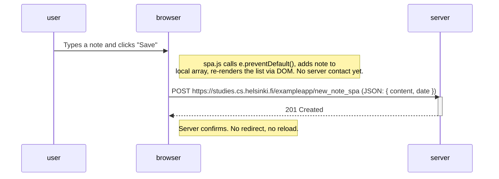

# Exercise 0.6: New Note in Single Page App Sequence Diagram

What happens when a user creates a new note using the SPA at https://studies.cs.helsinki.fi/exampleapp/spa.

```mermaid
sequenceDiagram
    participant user
    participant browser
    participant server

    user->>browser: Types a note and clicks "Save"

    Note right of browser: spa.js calls e.preventDefault(), adds note to<br/>local array, re-renders the list via DOM. No server contact yet.

    browser->>server: POST https://studies.cs.helsinki.fi/exampleapp/new_note_spa (JSON: { content, date })
    activate server
    server-->>browser: 201 Created
    deactivate server

    Note right of browser: Server confirms. No redirect, no reload.
```
